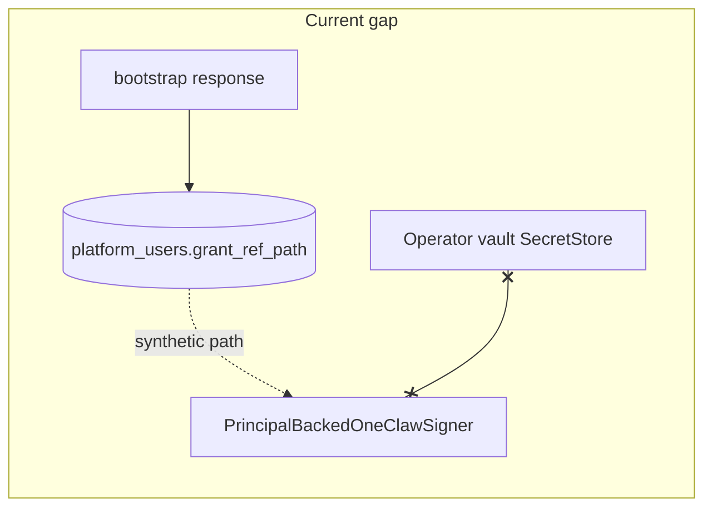

# Align codebase with platform-api.md

## What [platform-api.md](platform-api.md) establishes (vs current repo)

| Topic                | Doc says                                                                                | Codebase today                                                                                                                                                                                                                                                                       |
| -------------------- | --------------------------------------------------------------------------------------- | ------------------------------------------------------------------------------------------------------------------------------------------------------------------------------------------------------------------------------------------------------------------------------------ |
| Template `spec`      | `vault`, `agents`, `policies`; Intents via `**intents.enabled**` nested                 | Older notes in [1claw-integration-plan.md](1claw-integration-plan.md) still show `intents_api_enabled` / `signing_keys` in template — **wrong**                                                                                                                                      |
| Bootstrap response   | `claim_url`, `claim_token`, and `**summary`** with `vault_id`, `agent_id`, `policy_ids` | [service.py](src/aurey/cloud/onboarding/service.py) reads `**vault_id` / `agent_id` at top level** only (`boot.get("agent_id")`, `boot.get("vault_id")`) — **likely wrong vs live API/SDK**                                                                                          |
| Delegated tokens     | **Not wired yet** (`RFC 8693` DTO exists, route missing)                                | [secret_store.py](src/aurey/custody/secret_store.py) + [delegated_signer.py](src/aurey/custody/delegated_signer.py) always call `**POST /v1/auth/delegated-token`** when principal signing is used; [settings default scope](src/aurey/settings/__init__.py) documents that endpoint |
| Signing keys         | **Not in templates**; use `POST .../signing-keys` **after bootstrap**                   | Integration plan templates still contemplated template `signing_keys`                                                                                                                                                                                                                |
| Silent / `claim_url` | Silent still returns `**claim_url`**; headless/programmatic claim is **future**         | Onboarding UX already assumes browser claim — consistent; worth stating Pro subscription + limitation in runbook                                                                                                                                                                     |
| Upsert payload       | Quickstart shows `email` + `external_subject`                                           | [OneClawPlatformApiClient.upsert_user](src/aurey/cloud/platform/__init__.py) sends `**subject_token` + optional `display_name`** only (OIDC path) — **OK for silent,** but docs should clarify when to use which                                                                     |

## Critical second issue: `grant_ref_path` vs vault secrets

`[PrincipalBackedOneClawSigner](src/aurey/custody/delegated_signer.py)` calls `[SecretStore.get_secret(self._principal.grant_ref_path)](src/aurey/cloud/onboarding/grant_repository.py)` expecting a **real operator-vault secret** containing the grant/subject material.

`[OnboardingService](src/aurey/cloud/onboarding/service.py)` sets `grant_ref_path` via `[_build_grant_ref_path](src/aurey/cloud/onboarding/service.py)` (synthetic string like `vaults/{vault_id}/delegated_grants/...`) on claim-ready — **nothing writes a secret to the operator vault at that path** today.

So even if 1Claw shipped delegated-token tomorrow, **principal signing would still fail** until the operator stores a grant JWT (or future claim API provides one) at a configured path. The plan must address this explicitly (see below).

## Recommended implementation steps

### 1. Normalize bootstrap responses in the platform client

- In `[src/aurey/cloud/platform/__init__.py](src/aurey/cloud/platform/__init__.py)`, add a small normalizer (private helper) used by `bootstrap_connection` so returned dict always exposes:
  - `claim_url`, `claim_token` (if present),
  - `vault_id`, `agent_id`, `policy_ids` — read from `**summary` first**, then **fallback to top-level** for tests / older mocks.
- Update `[tests/test_cloud_platform_client.py](tests/test_cloud_platform_client.py)` and `[tests/test_cloud_onboarding.py](tests/test_cloud_onboarding.py)` to include at least one fixture with **nested `summary`** to lock the behavior.

### 2. Document operator reality in runbooks and fix stale integration docs

- Extend `[docs/runbooks/1claw-cloud-setup.md](docs/runbooks/1claw-cloud-setup.md)` to reference [platform-api.md](platform-api.md) as the template spec source: `**intents: { enabled: true }**`, optional `shroud_*`, policy table (`principal_ref`, `vault_ref`, `paths`, `permissions`, `conditions`), and **no template signing keys**.
- Add **Pro+ requirement** and the **Current limitations** bullets from platform-api (delegated-token not wired, silent still returns `claim_url`, `plt_` cannot list user signing keys cross-org).
- Update [1claw-integration-plan.md](1claw-integration-plan.md) §3 example template: remove `signing_keys` / flat `intents_api_enabled`; use nested `intents.enabled`; align policy examples with the doc (and use `agents.primary` / first-agent convention consistently).
- Optionally add a one-line pointer in [README.md](README.md) to `platform-api.md` for template authors.

### 3. Honest behavior for delegated signing (until 1Claw ships the route)

Pick one approach (recommend **A + B**):

- **A — Settings / docs:** Expand `[oneclaw_delegated_token_scope](src/aurey/settings/__init__.py)` field description to state that `**/v1/auth/delegated-token` is not yet available** per platform-api; scope value is **TBD** when the route ships; default may need to change.
- **B — Runtime guard:** When building a principal-backed signer (wherever the overlay is constructed — e.g. Telegram → `[invoke` path](src/aurey/service/invoke.py) / graph setup), if `SecretStore.get_secret(grant_ref_path)` would run: **pre-check** that the path exists (or catch the specific missing-secret error) and return a **clear user-facing message** (“Hosted signing requires delegated-token + grant secret at configured path”) instead of an opaque HTTP 404 from 1Claw.
- **C (optional flag):** Add something like `AUREY_CLOUD_HOSTED_SIGNING_ENABLED` defaulting to `false` until both delegated-token **and** vault grant material are confirmed, to avoid marking users `ready` for flows that cannot succeed.

### 4. Close the grant material gap (minimal, choose one direction)

Without a full redesign, the smallest coherent options:

- **Direction 1 (doc-first):** Treat `grant_ref_path` as an **operator-configured vault path template** env (e.g. `AUREY_HOSTED_GRANT_SECRET_PATH_TEMPLATE` with `{connection_id}` / `{agent_id}`), and document that **an external job or manual process** must place the user’s grant JWT at that path after claim. Stop generating purely synthetic paths in `_build_grant_ref_path` **or** map synthetic → configured template.
- **Direction 2 (future webhook):** Stub `[POST /v1/cloud/onboarding/claim-events](src/aurey/service/app.py)` to accept a **vault path or encrypted grant reference** from a trusted writer (only when 1Claw exposes claim completion payloads you can trust).

Recommendation: start with **Direction 1** documentation + a **settings-driven path pattern** so `PrincipalBackedOneClawSigner` reads a path that operators can actually populate; keep Phase C poll for **state only** if the platform never returns grant bytes.

### 5. Verify `GET /v1/platform/connections/{id}`

[platform-api.md](platform-api.md) does not list this route; `[OneClawPlatformApiClient.get_connection](src/aurey/cloud/platform/__init__.py)` depends on it for claim polling. **Confirm against live OpenAPI or 1Claw**; if the path or response shape differs, adjust `get_connection` and `[claim_parser.py](src/aurey/cloud/onboarding/claim_parser.py)` accordingly (out of scope if API unchanged).

### 6. Optional upsert enrichment

If 1Claw accepts `**external_subject` alongside `subject_token`** for correlation (as in the quickstart), consider adding `external_subject=f"telegram:{id}"` in `upsert_user` **without removing** `subject_token`, after verifying the API contract (may be redundant with JWT `sub`).

## Files likely touched

- `[src/aurey/cloud/platform/__init__.py](src/aurey/cloud/platform/__init__.py)` — bootstrap normalization
- `[src/aurey/cloud/onboarding/service.py](src/aurey/cloud/onboarding/service.py)` — only if bootstrap handling moves fully into client or needs `claim_token` persistence
- `[src/aurey/settings/__init__.py](src/aurey/settings/__init__.py)` — delegated / hosted signing documentation + optional flags / grant path template
- `[docs/runbooks/1claw-cloud-setup.md](docs/runbooks/1claw-cloud-setup.md)`, [1claw-integration-plan.md](1claw-integration-plan.md), possibly [README.md](README.md)
- Tests: `[tests/test_cloud_platform_client.py](tests/test_cloud_platform_client.py)`, `[tests/test_cloud_onboarding.py](tests/test_cloud_onboarding.py)`, optionally `[tests/test_oneclaw_signing_client.py](tests/test_oneclaw_signing_client.py)` for messaging

## Acceptance criteria

Treat the work as done when all of the following are true:

1. **Bootstrap parsing:** After `POST .../connections/{id}/bootstrap`, onboarding persists `vault_id` and `agent_id` correctly when the platform returns them **only under `summary`** (and still works when tests/mocks send them top-level). Automated tests cover the nested shape.
2. **Docs match platform-api.md:** Runbook states Pro+ requirement, template spec uses `**intents: { enabled: true }`** (not flat `intents_api_enabled`), no template signing keys, post-bootstrap signing-key provisioning called out; limitations match platform-api (delegated-token not wired, silent still returns `claim_url`, `plt_` cannot read user signing keys cross-org). [1claw-integration-plan.md](1claw-integration-plan.md) template JSON no longer shows removed/invalid spec fields.
3. **Delegated signing honesty:** Settings (and/or runbook) explicitly say `**/v1/auth/delegated-token` is not yet available** per 1Claw; scope env var is documented as provisional. Users or operators get a **clear error** when hosted principal signing is attempted but grant material or delegation is missing (not a bare 404 from 1Claw). If a feature flag is adopted, default is safe until grant + API are confirmed.
4. **Grant path strategy resolved:** Either (a) operator-configured vault path pattern + documentation for how grant JWT is placed after claim, with code using that path end-to-end, or (b) an explicit decision to defer principal signing with corresponding gating/messaging—no silent `ready` state that implies signing works when `SecretStore.get_secret` cannot succeed.
5. **Connection polling:** `GET /v1/platform/connections/{id}` is **verified** against current 1Claw API (or replaced with the correct route); claim polling tests still pass and `parse_claim_ready_signal` matches real payloads (or documented gaps).
6. **Regression suite:** `pytest` (at least cloud platform, onboarding, and signing-related tests touched by the change) passes; `ruff check` on edited files passes if that is repo standard for PRs.

**Optional (only if in scope):** `upsert_user` sends `external_subject` when API contract is confirmed; `claim_token` persisted if product needs it.

## Non-goals (unless you explicitly expand scope)

- Implementing server-side delegated-token (1Claw product work)
- Automatic per-user signing-key provisioning without human/claim UX
- Replacing claim polling with official webhooks until API is confirmed

