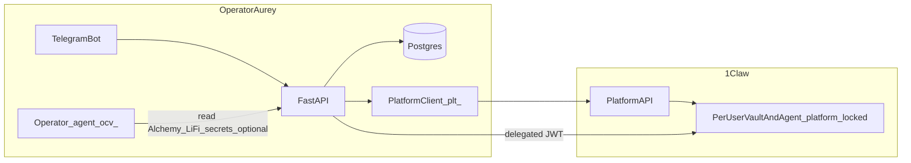

# Hosted Aurey + 1Claw Platform and Intents

## Current baseline (repo)

- **Single-tenant bootstrap**: `[bootstrap_aurey_service_state](src/aurey/service/bootstrap.py)` wires one `OneClawSecretStore` + `OneClawHttpClient` with `AUREY_ONECLAW_BOOTSTRAP_API_KEY`, `oneclaw_vault_id`, optional global `oneclaw_agent_id`.
- **Signing today**:
  - `vault_key`: reads raw key from vault via `[tx_execute](src/aurey/graphs/tx_execute.py)` → local Web3 sign + broadcast `[Web3TxPipeline.run_prepared](src/aurey/graphs/evm_tx_pipeline.py)`.
  - `oneclaw_intents` (stubbed name): `[run_prepared_with_oneclaw_signer](src/aurey/graphs/evm_tx_pipeline.py)` calls `[OneClawHttpClient.sign_evm_transaction](src/aurey/custody/secret_store.py)` → `**POST /v1/agents/{id}/sign`** (Intent-style unified sign), **then Aurey broadcasts** via Alchemy RPC resolved from `**alchemy_api_secret_path`** (vault read).
- **Prepare-time checks**: `[tx_prepare._evm_prepare_signing_settings_error](src/aurey/graphs/tx_prepare.py)` still ties `oneclaw_intents` to **global** `settings.oneclaw_agent_id` and optionally `wallet_signing_key_secret_path` as `signing_key_path` override.
- **Reads / quotes**: Alchemy + LiFi access is uniformly “path + `secret_store.get_secret`” (e.g. `[alchemy._resolve_alchemy_key](src/aurey/graphs/alchemy.py)`, `[read._alchemy_rpc_or_error](src/aurey/graphs/read.py)`, LiFi graphs).

Aligned internal doc (already drafted): [.cursor/plans/hosted_aurey_cloud_phases_a05ffd75.plan.md](.cursor/plans/hosted_aurey_cloud_phases_a05ffd75.plan.md). This plan aligns phases with your product wording and adjusts operator secrets as you requested.

---

## Target architecture

**Roles**

| Actor                     | Credential                                                                                            | Responsibility                                                                            |
| ------------------------- | ----------------------------------------------------------------------------------------------------- | ----------------------------------------------------------------------------------------- |
| Your deployment           | `plt_*` Platform API key                                                                              | `users/upsert`, `connections/{id}/bootstrap` only                                         |
| Your deployment           | Env: `OPENAI_*`, `**ALCHEMY_API_KEY`** (names TBD), `**LIFI_API_KEY`** (optional), Telegram token env | Operator-side services; **no raw user keys**                                              |
| Optional “operator agent” | `ocv_*` + operator vault id                                                                           | Delegated-token **actor**, and only if you still keep *some* secrets in 1Claw (see below) |
| End-user                  | Claim flow + MPC / user-held material                                                                 | Owns `**platform_locked`** vault + agent; grants delegation for intents                   |

**Silent provisioning (Platform “silent”)** fits Telegram if you avoid asking the user for an email:

- **Preferred**: Register your Platform app with `auth_mode: "silent"` + **OIDC** (`oidc_issuer`, `oidc_jwks_url`). Aurey exposes `**GET /.well-known/jwks.json`** (and minimal discovery if required) and mints short-lived `subject_token` JWTs whose `sub` is stable per Telegram identity (e.g. `telegram:{user_id}`). Then `POST /v1/platform/users/upsert` with `subject_token` (no email).
- **Alternative**: Silent upsert with a **deterministic synthetic email** per Telegram user (simpler operationally; confirm policy acceptability with 1Claw and your privacy stance).

Then `bootstrap(connection_id)` returns `**claim_url`**. Product copy: **“create a wallet”** = run provisioning + send `claim_url`; user completes claim in browser → user-owned vault/agent + signing material (non-custodial from your perspective: you never receive the raw private key).

---

## Intents signing path (implementation choice)

Official Intents flows emphasize `**POST /v1/agents/{agent_id}/transactions`** (simulate, sign, broadcast on 1Claw RPC) and `**/transactions/sign`** for BYORPC ([Intents API](https://docs.1claw.xyz/docs/guides/intents-api)).

**Today’s code uses `/sign` + local Alchemy broadcast**, which maps to Intents **sign-only / BYORPC**, not strictly `transactions`.

**Recommendation for the plan**

1. **Short term / minimal diff**: Keep **sign-only** semantics but route it through whichever 1Claw endpoint you standardize on (`/sign` vs `/transactions/sign`) using the **delegated JWT**, then broadcast with operator Alchemy (**env-based key**)—preserves existing receipt polling in `[_broadcast_signed_raw_and_wait](src/aurey/graphs/evm_tx_pipeline.py)`.
2. **Stricter “Intents API” alignment**: Implement `**submit_intent_transaction`** calling `**POST .../transactions`** with `simulate_first`, drop local broadcast for that path; adjust result handling (`tx_hash`, `status`) and reconcile with LiFi/multi-hop expectations.

Either way: **remove all code paths that `get_secret()` for wallet private key material** (`vault_key` mode and envelope fields that imply raw key retrieval).

---

## Delegation (required for “agent signs on behalf of user”)

Per [Platform API — Delegated access](https://docs.1claw.xyz/docs/guides/platform-api#delegated-access-when-your-agent-needs-to-read-user-secrets), your **operator agent (`ocv_`)** exchanges a short-lived JWT via `**POST /v1/auth/delegated-token`** using:

- `**subject_token`**: user grant JWT (issued after user connects / grants scopes in dashboard or claim flow),
- `**actor_token`**: `ocv_*`,
- `**scope`**: documented string permitting Intents/signing for that user agent (exact scope format is an integration TODO—pin when implementing; keep behind one settings constant).

**Implementation**: extend `[OneClawHttpClient](src/aurey/custody/secret_store.py)` (or a sibling `DelegationClient`) with delegated-token caching **keyed by user + scope**, mirroring `_access_token_expires_at` behavior for agent tokens.

**Per-invoke runtime**: refactor so `[tx_execute._execute_node](src/aurey/graphs/tx_execute.py)` uses `**principal.user_agent_id`** (from DB/session), **not** `runtime.settings.oneclaw_agent_id`. Same for any signer that attaches `Authorization: Bearer ...`.

---

## Data and onboarding

Use **same Postgres** as LangGraph checkpoints (`[database_url](src/aurey/settings/__init__.py)` / `[open_postgres_checkpointer](src/aurey/reasoning/checkpointer.py)`) with new tables (SQLAlchemy + Alembic), e.g.:

- Platform `connection_id`, claim URL, onboarding state (`awaiting_claim` → `ready`), `telegram_user_id` / internal user id,
- `**user_agent_id`**, `**wallet_address`** (from post-claim polling or signing-keys metadata when available),
- Reference to grant material **by id/path** — avoid storing long-lived grants in plaintext if 1Claw offers a vault path or rotation story.

**Claim detection**: poll Platform “connection/user” endpoints until claimed (per spec); optional webhook route on `[create_fastapi_application](src/aurey/service/app.py)` later.

**Telegram**: extend `[build_telegram_application](src/aurey/telegram/client.py)`—`/start` (or explicit “create wallet”) runs provisioning; normal messages `[handle_telegram_text` → `invoke_deep_agent_turn](src/aurey/service/invoke.py)` only when onboarding `ready`.

**Sessions**: stabilize `thread_id` (avoid bare group chat ids if shared); prefer per-user UUID in `[thread_config](src/aurey/reasoning/checkpointer.py)`.

---

## Settings and env refactor (your explicit ask)

Add **hosted** configuration (names illustrative):

- `AUREY_PLATFORM_APP_ID`, `AUREY_PLATFORM_API_KEY` (`plt_`), `AUREY_PLATFORM_TEMPLATE_ID`
- OIDC issuer URL + JWKS private key material (unless using synthetic-email upsert instead)
- `AUREY_OPERATOR_AGENT_ID`, `AUREY_OPERATOR_AGENT_API_KEY` (`ocv_*`), `AUREY_OPERATOR_VAULT_ID` **only if** you still resolve any secret via 1Claw for the operator agent
- `**AUREY_ALCHEMY_API_KEY`** (and optional `AUREY_LIFI_API_KEY`) as **direct env** values
- `**AUREY_TELEGRAM_BOT_TOKEN`** (env) preferred over vault path for hosted simplicity

**Code touch list** for moving Alchemy/LiFi off vault paths: `[alchemy._resolve_alchemy_key](src/aurey/graphs/alchemy.py)`, `[evm_tx_pipeline](src/aurey/graphs/evm_tx_pipeline.py)` (alchemy path block), `[read](src/aurey/graphs/read.py)`, `[swap_prepare](src/aurey/graphs/swap_prepare.py)`, `[earn](src/aurey/graphs/earn.py)`, `[lifi_status](src/aurey/graphs/lifi_status.py)`, plus prompt text in `[deep_agent.wallet_context_for_deep_agent_prompt](src/aurey/reasoning/deep_agent.py)` and tool docstrings in `[agent_tools](src/aurey/tools/agent_tools.py)`.

---

## removals / breaking changes (acceptable)

- Default **remove `vault_key`** signing mode from the hosted deployment path (or delete entirely): `[tx_execute](src/aurey/graphs/tx_execute.py)`, `[PreparedTxEnvelope](src/aurey/graphs/results.py)`, `[tx_prepare](src/aurey/graphs/tx_prepare.py)`, `[lifi_envelope](src/aurey/graphs/lifi_envelope.py)`.
- Remove `**wallet_signing_key_secret_path**` and any `get_secret` used only for signing material.
- Simplify bootstrap: singleton **platform + operator** wiring; **per message** compose `AureyRuntime` / principal (supersedes single global `OneClawSecretStore` for users).

---

## Phase checklist (implementation order)

1. **Operator + Platform registration (runbook)**: Register app (`plt_`), create template (`vault`, `agents` with `**intents_api_enabled: true`**, policies aligned with intents signing + any delegation requirement), wire env.
2. **Platform client + persistence + Telegram onboarding**: `upsert`, `bootstrap`, store `claim_url`, idempotent `/start`.
3. **OIDC JWKS surface** (if chosen) + claim polling → `ready` state + stored `user_agent_id` / wallet metadata.
4. **Delegated-token + per-user signing**: refactor `tx_prepare`/`tx_execute`/`Web3TxPipeline`; optional migrate `/sign` → `/transactions` per decision above.
5. **Cut over Alchemy/LiFi/Telegram to env** for hosted reads and broadcast.
6. **Tests**: fakes for Platform + delegated JWT + signer HTTP; extend `[tests/test_evm_tx_pipeline.py](tests/test_evm_tx_pipeline.py)` / graph tests for per-user `agent_id`.

---

## Risks / open specs

- Exact `**delegated-token` `scope`** string for Intents/transactions/sign.
- Bootstrap template JSON field names (`**intents_api_enabled`**) and whether signing keys are created at template vs post-claim only.
- Telegram-only UX: user must complete **browser claim** once; messaging should set expectations.

