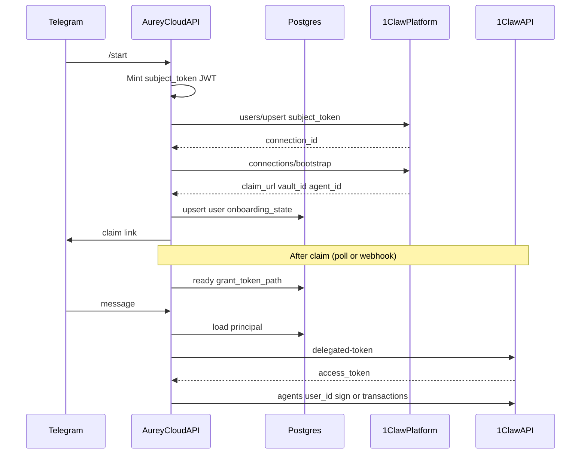

# Hosted Aurey: phased implementation plan

## Reference resources

Use these when shaping or implementing any phase — especially if requirements vs 1Claw behavior are ambiguous.

| Resource | Purpose |
| --- | --- |
| [1claw-integration-plan.md](../../1claw-integration-plan.md) | Repo-local integration notes and decisions (companion to this phased plan). |
| [Platform API — What gets created during bootstrap](https://docs.1claw.xyz/docs/guides/platform-api#what-gets-created-during-bootstrap) | What `plt_` can and cannot do; `platform_locked` resources; end-to-end provision/claim flow. |
| [Intents API](https://docs.1claw.xyz/docs/guides/intents-api) | `intents_api_enabled`, unified `/sign`, `POST .../transactions`, signing-key provisioning (human-only), guardrails. |

**Note**: Paths in this repo are referenced from workspace root (`1claw-integration-plan.md`); the table link above is relative to this plan file (`/.cursor/plans/`).

---

## Documented assumptions (revisit when 1Claw answers)

- **Template**: Bootstrap template can set `intents_api_enabled: true` on the per-user agent (field name matches standard agent create API). Signing keys are **user-provisioned at claim** (human-only per [Intents API](https://docs.1claw.xyz/docs/guides/intents-api)); template does not auto-create chain keys.
- **Delegated auth**: `POST /v1/auth/delegated-token` accepts a **user grant** `subject_token` plus **actor** `ocv_` API key and returns a short-lived JWT usable for `POST /v1/agents/{user_agent_id}/transactions` and/or unified `/sign` with a documented `scope` string (exact scope TBD; implement behind a single config constant).
- **Claim completion**: Either a **webhook** from 1Claw or **polling** `GET /v1/platform/apps/{id}/users` / connection status until `claimed` — implement **polling first** (simpler, no external URL dependency), add webhook when confirmed.
- **OIDC**: Platform app uses `auth_mode: silent` with `oidc_issuer` + `oidc_jwks_url` pointing at this service; `users/upsert` receives `subject_token` JWT with `sub` stable per Telegram user (e.g. `telegram:{user_id}`).
- **Product scope**: This repo becomes **cloud-first**; legacy single `AUREY_ONECLAW_VAULT_ID` + global agent paths may be **removed or heavily simplified** (no compatibility guarantee).

---

## Architecture snapshot (end state)

**Operator vs user split** (unchanged from design discussion): `plt_` for provisioning only; **operator** `ocv_` + operator vault for Alchemy/LiFi/Telegram bot token; **per-user** vault/agent for signing via delegation.

---

## Phase A — Operator and platform registration (mostly runbook + config)

**Goal**: One-time setup so the codebase has `app_id`, `plt_` key, `template_id`, operator vault/agent ids, and OIDC URLs registered on the 1Claw app.

**Deliverables**

- **Runbook** (short markdown in repo only if you want it; optional): steps mirroring [Platform API](https://docs.1claw.xyz/docs/guides/platform-api) (see also [what bootstrap creates](https://docs.1claw.xyz/docs/guides/platform-api#what-gets-created-during-bootstrap)) — `POST /v1/platform/apps`, `POST .../templates`, create **separate** operator agent with `ocv_` key (not the platform app key).
- **Environment contract**: New settings module or section defining e.g. `AUREY_PLATFORM_APP_ID`, `AUREY_PLATFORM_API_KEY` (`plt_`), `AUREY_PLATFORM_TEMPLATE_ID`, `AUREY_OPERATOR_VAULT_ID`, `AUREY_OPERATOR_AGENT_ID`, `AUREY_OPERATOR_AGENT_API_KEY` (`ocv_`), plus existing `AUREY_ONECLAW_BASE_URL`, model keys, `DATABASE_URL`.
- **Optional CLI** (`scripts/` or `uv run python -m aurey.cloud.bootstrap_platform`): idempotent “create template if missing” to reduce human error (can be Phase B if you prefer minimal Phase A).

**Code touch**: Primarily [src/aurey/settings/**init**.py](src/aurey/settings/__init__.py) rename/split; no user DB yet.

---

## Phase B — OIDC surface, platform client, Postgres users, Telegram onboarding

**Goal**: On `/start`, mint `subject_token`, call `users/upsert` and `connections/{id}/bootstrap`, persist user + `connection_id` + `claim_url` + `vault_id` / `agent_id` metadata, reply with claim link.

**Deliverables**

1. **OIDC issuer (minimal)**
  - **Private key**: stored at operator vault path or env (assumption: RSA/EC key for RS256/ES256).  
  - **Endpoints** (mount on same FastAPI app or sub-app): `GET /.well-known/openid-configuration` (optional), `**GET /.well-known/jwks.json`**, `**GET` issuer base** if required by 1Claw validator.  
  - **JWT builder**: `iss`/`aud`/`sub`/`exp` aligned with values registered on the 1Claw platform app.
2. **Platform HTTP client** (`src/aurey/cloud/platform_client.py` or similar):
  - `upsert_user(subject_token: str, display_name: str | None)`  
  - `bootstrap(connection_id: str, template_id: str)`  
  - Auth: `Authorization: Bearer plt_...`
3. **Persistence**
  - Add **SQLAlchemy + Alembic** (or preferred minimal layer) migrations alongside LangGraph Postgres ([src/aurey/reasoning/checkpointer.py](src/aurey/reasoning/checkpointer.py) already uses same `DATABASE_URL`).  
  - Tables: `platform_users` (telegram ids, `oneclaw_*` ids, onboarding state, `claim_url`, timestamps), `onboarding_events` (audit), optional `bootstrap_attempts` idempotency.  
  - **Do not** store raw long-lived grant tokens in plaintext DB column if avoidable — prefer **operator vault path** reference after claim Phase C fills it.
4. **Telegram**
  - Extend [src/aurey/telegram/client.py](src/aurey/telegram/client.py) `/start`: if user not `ready`, run onboarding pipeline; otherwise delegate to existing [invoke_deep_agent_turn](src/aurey/service/invoke.py).  
  - Resolve operator bot token from **operator** secret store unchanged pattern.

**Exit criteria**: New user gets DB row + working `claim_url`; repeat `/start` is idempotent (`upsert` semantics).

---

## Phase C — Claim completion, grants, readiness

**Goal**: Transition `onboarding_state` from `awaiting_claim` → `ready` when the user finishes claim and (assumption) a **grant token** exists for delegated Intents.

**Deliverables**

- **Polling worker** (async loop or Celery-lite timer): periodic `GET` platform APIs to detect claim completion for rows in `awaiting_claim` (exact endpoint/field per 1Claw spec when available). **Alternative/add-on**: `POST /v1/cloud/webhooks/1claw` if webhooks confirmed.  
- **Grant capture**: When 1Claw exposes grant material (webhook payload, connection detail API, or post-claim redirect with one-time token — **assumption**: store **vault path** under operator vault `users/{internal_id}/grant` written by a **user-facing redirect** through your backend, or API response from poll). Stub interface `GrantRepository` until response format is known.  
- **State machine**: strict allowed transitions + `onboarding_events` logging.  
- **Telegram nudge**: message template when still `awaiting_claim` vs `ready`.

**Exit criteria**: User in `ready` has everything Phase D needs: `user_agent_id`, `user_grant` reference (path or ciphertext), optional `wallet_address` from signing-keys list if obtainable from poll.

---

## Phase D — Per-user delegated runtime and graph wiring

**Goal**: Each Telegram turn loads **user principal**, obtains **short-lived delegated JWT**, runs Deep Agent with **operator** RPC (Alchemy) + **user** signer (1Claw Intents/unified sign).

**Deliverables**

1. **Delegation client**
  Extend or wrap [OneClawHttpClient](src/aurey/custody/secret_store.py): alongside existing `POST /v1/auth/agent-token`, implement `**POST /v1/auth/delegated-token`** with `subject_token` (grant), `actor_token` (`ocv_`), `scope`.  
  - **Token cache keyed by** `(user_agent_id, scope)` with same skew pattern as `_access_token_expires_at`.
2. **Runtime model**
  - Introduce `UserPrincipal` (or inject into `AureyRuntime` per invoke): `user_agent_id`, `delegated_signer`, optional `wallet_address` for prompts.  
  - **Operator** `OneClawSecretStore`: `vault_id=operator`, `agent_id=operator`, `api_key=ocv_` for Alchemy/LiFi/Telegram paths only.  
  - **Signing path**: Use existing [run_prepared_with_oneclaw_signer](src/aurey/graphs/evm_tx_pipeline.py) / [tx_execute](src/aurey/graphs/tx_execute.py) `oneclaw_intents` branch but **stop using global** `runtime.settings.oneclaw_agent_id` — pass **per-user** `agent_id` from principal (refactor `_execute_node` and pipeline call sites).  
  - Default **remove or gate** `vault_key` signing for the cloud product to reduce branches (assumption: cloud = `oneclaw_intents` only).
3. **Thread and prompt**
  - LangGraph `thread_id`: prefer `user:{db_uuid}` over raw `telegram:{chat_id}` for stability ([thread_config](src/aurey/reasoning/checkpointer.py)).  
  - Move “my wallet” from global [wallet_context_for_deep_agent_prompt](src/aurey/reasoning/deep_agent.py) to `**configurable` / `aurey_context`** populated per invoke from DB.
4. **Bootstrap assembly**
  Replace or supersede [bootstrap_aurey_service_state](src/aurey/service/bootstrap.py): build **singleton** operator client + DB session factory; **per message** compose `AureyRuntime(principal=...)`.
5. **HTTP**
  - Mount Phase B OIDC routes + optional webhook on [create_fastapi_application](src/aurey/service/app.py).
6. **Tests**
  - Fakes for platform client + delegated-token + sign endpoint; integration test: mock chain from `/start` to `invoke` with `DeterministicTxPipeline` where signer is patched.

**Exit criteria**: End-user can complete claim (Phase C assumed) and execute a sponsored flow using Intents/sign with user keys; Alchemy/LiFi remain operator-wide.

---

## Risk register (track against 1Claw replies)

- **Scope string** for delegated-token may block signing until defined.  
- **Claim UX** may require browser step (MPC / key provision); Telegram-only assertion may need product copy change.  
- **Human-only signing-keys**: first-tx UX must handle “keys not provisioned yet” cleanly in tools/errors.

