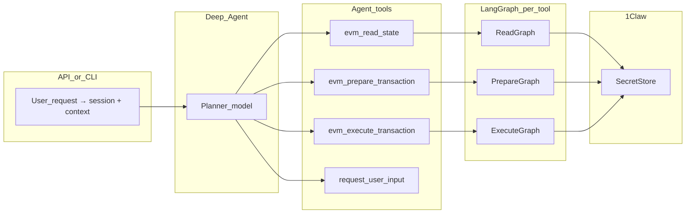

# Standalone deep agent, multi-tool graphs, 1Claw secrets

## Goals

- **One runtime** (no separate “orchestrator agent” ↔ “executor service” hops for normal work).
- **Deep Agents** for high-level planning; **narrow tools** with Pydantic args so the model stops guessing opaque JSON.
- **LangGraph per tool** where procedures must be deterministic (validate → fetch chain state → build → simulate → sign/broadcast).
- **1Claw** as the only path for API keys, RPC URLs, and signing material; configs hold **paths**, never secret values, matching the contract described in Mercury’s README and [`mercury/custody/oneclaw.py`](https://github.com/YourOrg/your-repo/blob/main/mercury/custody/oneclaw.py) (copy the **ideas**, not the monorepo path).

## Target architecture

**Composition rule:** implement shared logic in plain Python modules (tx building, encoding); LangGraph nodes call those functions. Child graphs can be invoked from a parent graph via a small “runner” helper, not by adding more agent tools.

## Phase 1 — Project skeleton and dependencies

- **Stack:** Python 3.12+, `langchain`, `langgraph`, `deepagents` (same family Mercury uses in [`mercury/reasoning/deep_graph.py`](file:///Users/fabri/agentic-pantheon/mercury-agentic-wallet/mercury/reasoning/deep_graph.py)), `pydantic-settings`, optional `fastapi` + `uvicorn` for HTTP.
- **Layout (suggested):**
  - `src/<app>/settings.py` — paths-only secret references + 1Claw connection settings.
  - `src/<app>/custody/secret_store.py` — `SecretStore` protocol + `OneClawSecretStore` + HTTP client (port Mercury’s minimal shape: vault id, optional `agent_id`, `get_secret` by path).
  - `src/<app>/reasoning/harness.py` — register Deep Agents harness profile (disable unused middleware like Mercury’s `ensure_mercury_wallet_harness` pattern in [`mercury/reasoning/harness.py`](file:///Users/fabri/agentic-pantheon/mercury-agentic-wallet/mercury/reasoning/harness.py)).
  - `src/<app>/reasoning/deep_agent.py` — `create_deep_agent(..., tools=[...], checkpointer=...)`.
  - `src/<app>/tools/` — LangChain `@tool` definitions + input models.
  - `src/<app>/graphs/` — compiled subgraphs per tool.
  - `src/<app>/runtime.py` — wires `GraphRuntime`-like deps (secret store, web3/provider factory) passed into tools/graphs.

## Phase 2 — 1Claw secret store integration

**Contract (mirror Mercury):**

- Settings fields: `oneclaw_base_url`, `oneclaw_vault_id`, `oneclaw_api_key_secret_source` (env **name** holding bootstrap API key), optional `oneclaw_agent_id`.
- All other secrets (provider keys, wallet key paths, Telegram token) are **string paths** in settings. EVM RPC URLs are derived from the shared `alchemy_api_secret_path`, e.g. `https://eth-mainnet.g.alchemy.com/v2/${ALCHEMY_KEY}`, with values resolved at use time via `SecretStore.get_secret(path).reveal()` inside non-LLM code only.
- Typed wrapper `SecretValue` with `reveal()`; **never** log or return revealed values; redact in errors (see Mercury’s logging patterns).

**Testing:** provide `FakeSecretStore` / `FakeOneClawClient` for unit tests (same idea as [`tests/fakes/secret_store.py`](file:///Users/fabri/agentic-pantheon/mercury-agentic-wallet/tests/fakes/secret_store.py)).

## Phase 3 — Tools that mirror Mercury

Mercury today collapses behavior behind `mercury_invoke` `kind` values. For a standalone deep agent, expose **one schema-first tool per capability family** (or one tool with a discriminated union)—either is fine if args are strict. Below is a **parity map** to Mercury’s modules ([`mercury/graph/intents.py`](file:///Users/fabri/agentic-pantheon/mercury-agentic-wallet/mercury/graph/intents.py), [`mercury/tools/`](file:///Users/fabri/agentic-pantheon/mercury-agentic-wallet/mercury/tools/), [`mercury/graph/runtime.py`](file:///Users/fabri/agentic-pantheon/mercury-agentic-wallet/mercury/graph/runtime.py)).

### On-chain reads (JSON-RPC via 1Claw RPC path)

These correspond to `ReadOnlyIntentKind` / [`create_readonly_tools`](file:///Users/fabri/agentic-pantheon/mercury-agentic-wallet/mercury/tools/__init__.py) (EVM + ERC-20 + known addresses).

| Suggested agent tool      | Mercury `kind` / source | Notes                                       |
| ------------------------- | ----------------------- | ------------------------------------------- |
| `evm_get_native_balance`  | `native_balance`        | One chain + wallet address.                 |
| `evm_get_erc20_balance`   | `erc20_balance`         | Token + wallet.                             |
| `evm_get_erc20_allowance` | `erc20_allowance`       | Owner + spender + token.                    |
| `evm_get_erc20_metadata`  | `erc20_metadata`        | Symbol/decimals on-chain.                   |
| `evm_contract_read`       | `contract_read`         | ABI fragment + function + args (view/pure). |
| `resolve_known_address`   | `known_address`         | Bundled ticker/protocol map (no RPC).       |

*Alternative:* single `evm_read` tool with a required `operation` enum covering the rows above—fewer tools for the planner, slightly richer schemas.

### Alchemy-backed reads (REST + node; API key from 1Claw path)

Mercury registers these optionally in [`ReadOnlyToolRegistry.from_provider_factory`](file:///Users/fabri/agentic-pantheon/mercury-agentic-wallet/mercury/tools/registry.py).

| Suggested agent tool           | Mercury `kind`     | 1Claw                                                                  |
| ------------------------------ | ------------------ | ---------------------------------------------------------------------- |
| `alchemy_get_token_prices`     | `token_prices`     | `alchemy_api_secret_path` (or equivalent).                             |
| `alchemy_get_portfolio_tokens` | `portfolio_tokens` | Same key; portfolio REST routes.                                       |
| `alchemy_get_transfer_history` | `transfer_history` | JSON-RPC `alchemy_getAssetTransfers` style (Mercury’s implementation). |

Keep the same **redaction rules** as Mercury: responses and logs must not leak raw API keys or RPC URLs.

### Swaps (LiFi + optional CoW / Uniswap)

Mercury routes `kind: "swap"` through [`build_swap_transaction_graph`](file:///Users/fabri/agentic-pantheon/mercury-agentic-wallet/mercury/graph/agent.py) and [`SwapRouter`](file:///Users/fabri/agentic-pantheon/mercury-agentic-wallet/mercury/swaps/) (LiFi primary; CoW typed orders branch to a terminal path; Uniswap API config exists for quotes).

| Suggested agent tool                    | Mercury behavior            | Notes                                                                                                           |
| --------------------------------------- | --------------------------- | --------------------------------------------------------------------------------------------------------------- |
| `swap_prepare` (or `lifi_prepare_swap`) | `prepare_swap` / swap graph | Quote + route + build **next** tx (approval vs swap vs typed order). Requires subgraph for deterministic steps. |
| `swap_quote_or_route`                   | Sub-step of above           | **Optional** separate tool if you want read-only quotes without touching execution.                             |

Signing/broadcast for EVM swap legs still flows through the same **execute** pipeline as transfers (below).

### Value-moving operations (require `idempotency_key` in Mercury)

| Suggested agent tool         | Mercury `kind`    | Graph / module                                                                                              |
| ---------------------------- | ----------------- | ----------------------------------------------------------------------------------------------------------- |
| `tx_prepare_native_transfer` | `native_transfer` | [`nodes_native`](file:///Users/fabri/agentic-pantheon/mercury-agentic-wallet/mercury/graph/nodes_native.py) |
| `tx_prepare_erc20_transfer`  | `erc20_transfer`  | [`nodes_erc20`](file:///Users/fabri/agentic-pantheon/mercury-agentic-wallet/mercury/graph/nodes_erc20.py)   |
| `tx_prepare_erc20_approval`  | `erc20_approval`  | Same                                                                                                        |
| `tx_execute` (generic)       | Phase 6 pipeline  | Simulate → policy → **1Claw sign** → broadcast → receipt (Mercury’s transaction pipeline).                  |

You can expose **one** `tx_execute` that accepts a prepared-tx envelope from any prepare tool, or separate execute entrypoints—parity is the same underlying pipeline.

### UX / planning

| Tool                 | Mercury analog                              |
| -------------------- | ------------------------------------------- |
| `request_user_input` | `mercury_request_user_input` / clarify flow |

### Optional parity (later)

- **Alchemy Notify webhook verify:** Mercury resolves a signing key via 1Claw ([`mercury/webhooks/keys.py`](file:///Users/fabri/agentic-pantheon/mercury-agentic-wallet/mercury/webhooks/keys.py))—not an agent tool unless you expose “verify incoming webhook.”

### Initial milestone sizing

For a first drop, a practical subset is: **all on-chain reads as one or five tools** + **three Alchemy tools** + **`swap_prepare`** + **`tx_prepare_*`** (or one generic prepare) + **`tx_execute`** + **`request_user_input`**. Add CoW-only subtleties when you need typed-order parity.

**Design rules:**

- Each `@tool` accepts a **Pydantic model**; docstrings list valid enums (chain ids, token refs).
- Tool implementation = `compiled_subgraph.invoke(tool_input | runtime_context)`, not raw LLM text.
- Return **structured JSON-serializable results** + stable error codes (`needs_approval`, `unsupported_chain`, `simulation_failed`) so the deep agent can continue without guessing payloads.

## Phase 4 — Deep Agent wiring

- **System prompt:** capability list + “use smallest tool set” + “never invent chain outcomes.”
- **Harness:** register profile for your model spec string (Mercury pattern: trim filesystem/subagent noise via `HarnessProfileConfig`).
- **Checkpointer:** LangGraph `MemorySaver` or production saver (Mercury: [`mercury/reasoning/checkpointer.py`](file:///Users/fabri/agentic-pantheon/mercury-agentic-wallet/mercury/reasoning/checkpointer.py)) keyed by `session_id`.
- **Context schema:** optional `TypedDict` or Pydantic `Context` passed with `invoke` (wallet id, user id, approval state)—same idea as `MercuryContext` in Mercury’s Juno graph builder.

## Phase 5 — Service boundary (optional but recommended)

- Single `POST /v1/chat` or `invoke` endpoint that passes user text + context into the compiled deep agent graph.
- Dependency injection constructs `SecretStore` once per process (like [`mercury/service/dependencies.py`](file:///Users/fabri/agentic-pantheon/mercury-agentic-wallet/mercury/service/dependencies.py)).

## Phase 6 — Tests and hardening

- Unit: each graph with fake secret store + mocked RPC.
- Contract: tool schemas snapshot-tested so the planner’s valid JSON stays stable.
- Security: regression test that responses and exceptions never contain revealed secrets or raw RPC URLs if you treat those as sensitive (Mercury documents this expectation).

## What to copy vs rewrite from Mercury

- **Copy patterns:** `SecretStore` protocol, `OneClawHttpClient` flow, settings as paths, harness + `create_deep_agent` wiring, and the **capability surface** above (RPC reads, Alchemy trio, LiFi-centered swap prep + other swap backends, tx prepare/execute pipeline).
- **Do not copy mechanically:** Juno’s remote `invoke` loop or Telegram-only shapes—keep **the same semantics** as Mercury’s `kind` fields but expose them as **named tools** with Pydantic args and optional Telegram-style approval blobs only if you still need that channel.

## Success criteria for “initial plan” complete

- Deep Agent runs with **multiple tools** (not one `invoke`), covering at minimum **one EVM read**, **one Alchemy read**, **swap prepare**, and **execute** (or prepare+execute for a simple transfer).
- LangGraph-backed subgraphs exist for the value-moving path and at least one read path; tests use `FakeSecretStore`.
- Live configuration uses **1Claw** for RPC, Alchemy, LiFi/swap provider keys, and signing key paths; bootstrap 1Claw API key only via env as in Mercury.
