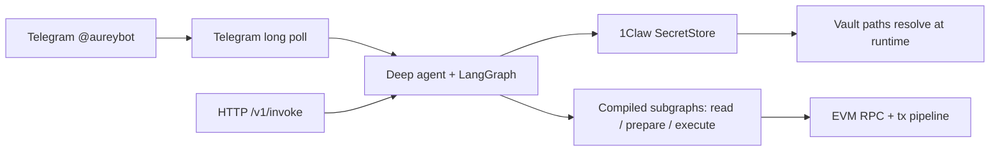

# Aurey

> **Telegram agent for a production-grade EVM wallet.** Chat on Telegram — reason over chain state, compose DeFi flows, and broadcast transactions — with **vault-backed custody via [1Claw](https://docs.1claw.xyz)** so operators ship a **secure agent** without drowning in key sprawl.

**Talk to Aurey on Telegram:** [@aureybot](https://t.me/aureybot)

**LangChain brains. Secrets that never sleep in `.env`.**

[LangGraph](https://github.com/langchain-ai/langgraph)  
[Deep Agents](https://github.com/langchain-ai/deepagents)  
[1Claw](https://docs.1claw.xyz)  
[FastAPI](https://fastapi.tiangolo.com/)  
[GitHub stars](https://github.com/agentic-pantheon/aurey)

**[⭐ Star if you ship agents](https://github.com/agentic-pantheon/aurey)** · **[Report an issue](https://github.com/agentic-pantheon/aurey/issues/new)** · **[Agentic Pantheon org](https://github.com/agentic-pantheon)**

---

## ✨ Why Aurey?


| Problem                                             | Aurey                                                                                                                  |
| --------------------------------------------------- | ---------------------------------------------------------------------------------------------------------------------- |
| Autonomous wallets leak keys into env vars and logs | Configuration holds **vault paths only** — **1Claw** resolves provider material through a **Secret Store** abstraction |
| “Agent demos” ≠ production graph logic              | Built on **LangGraph** + Deep Agents harness for repeatable, inspectable workflows                                     |
| Web3 × AI integrations sprawl forever               | Batteries-included EVM tooling (reads, prepares, executes) behind a **Telegram-first** interface (plus HTTP for integrations) |


If you’re an **AI agent builder**, **Web3 developer**, or **protocol team** shipping user-facing autonomy, Aurey is the **Telegram agent → secure autonomous wallet** path that stays boring where it matters: **custody**.

---

## 🚀 Key features

- ✈️ **Telegram-native agent** — Primary surface is Telegram; message [@aureybot](https://t.me/aureybot) or run your own bot with the same stack. Long-polling bot shares agent state with the HTTP API.
- 🧠 **LangGraph-powered reasoning** — Compose graphs per capability; deterministic boundaries between “think,” “simulate,” and “send.”  
- 🔐 **1Claw-first security** — **Secure agent** pattern: bootstrap API key from a named env var; everything else resolves from the vault.
- ⛓️ **Native EVM agentic wallet** — Read chain state, prepare and execute transactions, interoperate with real protocols (routing / yield flows per your tooling).   
- 🗄️ **Postgres checkpoints** — Optional **PostgreSQL** LangChain checkpointer for resilient multi-turn sessions.  
- 📊 **Operations-ready hooks** — LangSmith-friendly tracing knobs; structured agent trace for evaluations.

---

## ⚡ Quick start

### 1 · Install dependencies

```bash
git clone https://github.com/agentic-pantheon/aurey.git
cd aurey

uv sync --group dev           # core + dev toolchain
uv sync --group dev --extra api      # FastAPI HTTP service
uv sync --group dev --extra telegram # Telegram bot (recommended for local dev)
```

### 2 · Configure environment (minimal)

```bash
cp .env.example .env
```

Set at least `**AUREY_ONECLAW_VAULT_ID**`, `**AUREY_ONECLAW_BOOTSTRAP_API_KEY**` (the bootstrap key’s value goes in env; vault entries stay path-based), and wire the planner model. **By default (`AUREY_LLM_PROXY=shroud`),** Aurey sends chat completions via [Shroud](https://docs.1claw.xyz/docs/guides/shroud): set `**AUREY_ONECLAW_AGENT_ID`** plus the operator/agent credential (delegated actor or bootstrap key). Optionally set `**OPENAI_API_KEY**` as an `X-Shroud-Api-Key` override or rely on Vault (`providers/openai/api-key`; see [.env.example](.env.example)). For local debugging without Shroud, set `**AUREY_LLM_PROXY=direct`** and `**OPENAI_API_KEY`**. See [.env.example](.env.example) for vault paths (**Alchemy**, **LiFi**, **signing key**, **Telegram bot token**, etc.). **Do not inline production secrets.**

For Telegram, store the BotFather token in 1Claw and set `**AUREY_TELEGRAM_BOT_TOKEN_SECRET_PATH**` to that vault path (same pattern as other secrets).

### 3 · Run the Telegram bot locally

From an environment with `**aurey[telegram]**` installed and Telegram token configured:

```bash
uv run python run_telegram.py
```

Open Telegram, find your bot (or use [@aureybot](https://t.me/aureybot) when talking to the hosted deployment), and chat. The bot uses the same LangGraph agent and vault-backed signing as production.

### 4 · Run the HTTP API locally (optional)

From an environment with `**aurey[api]**` installed:

```bash
uv run python run_http.py --host 127.0.0.1 --port 8000
```

Smoke `**GET /health**`, then call `**POST /v1/invoke**` with JSON: `message`, `session_id`, optional `context`, optional `model`. Responses follow `InvokeResponse` — errors surface **stable codes** without secret leakage.

---

## 🎬 Demo


**[Watch on YouTube →](https://youtu.be/3AVGVJ9BWfQ)**

---

## 🏗 Architecture

### Request path (mental model)




### Repository layout (`src/aurey/`)


| Area         | Role                                                                                          |
| ------------ | --------------------------------------------------------------------------------------------- |
| `settings/`  | Pydantic settings — **vault path references**, bootstrap API key env **name**, model defaults |
| `custody/`   | `SecretStore`, `SecretValue`, `OneClawHttpClient`, fakes for tests                            |
| `reasoning/` | Deep agent harness, factory                                                                   |
| `tools/`     | LangChain tool surfaces                                                                       |
| `graphs/`    | LangGraph subgraphs (EVM codecs, swaps, txs, checkpoints)                                     |
| `service/`   | FastAPI app, bootstrap, adapters, `**/v1/invoke`**                                            |
| `telegram/`  | Telegram bot — shares `**AureyServiceState`** with HTTP                                       |


### Develop & test

```bash
uv run ruff check src tests
uv run pytest
```

For integration tests **without live models**, inject `state=` into `**create_fastapi_application`** or patch `**create_aurey_deep_agent`** (see codebase tests).

---

## 🏛️ Part of **Agentic Pantheon**

**[Agentic Pantheon](https://github.com/agentic-pantheon)** is the security-first ecosystem for autonomous systems — where **LangChain**, **1Claw**, and opinionated repos meet so teams ship agents that behave in production.

- **THIS REPO (`aurey`)** — **Telegram EVM wallet agent** + optional HTTP service shell.  
- **Organization** → explore sibling projects (**Juno**, **Mercury**, **Fabietto** and more) under **[github.com/agentic-pantheon](https://github.com/agentic-pantheon)**.

If Aurey resonates, **follow the org**!!!

---

## 🗺 Aurey's Roadmap

High-signal priorities (intent, not a promise ledger):


| Horizon   | Themes                                                                                |
| --------- | ------------------------------------------------------------------------------------- |
| **Now**   | Harden onboarding (templates, presets), expand eval scenarios, docs for signing modes |
| **Next**  | Deeper composability packs (routing, risk checks), tighter observability dashboards   |
| **Later** | Hosted “secure agent wallet” playbook, audits, institutional deployment guides        |


👉 **Tell us what to build next:** open **[issues](https://github.com/agentic-pantheon/aurey/issues)** with protocol or infra requirements.

---

## 🚂 One-click deploy on Railway

Host your own Telegram agent (same stack as [@aureybot](https://t.me/aureybot)) on Railway. The default start command runs `**run_telegram.py**` — your bot handle comes from the token you configure in 1Claw.

**Before Railway:** create a **1Claw account** so Aurey has a vault and agent to talk to ([docs](https://docs.1claw.xyz)):

1. **Create an account** — Sign up or log in to the **[1Claw dashboard](https://1claw.xyz/)**.
2. **Create a vault** — Add a vault for your deployment. Inside it, create **secret entries at these paths** (the path strings are yours to choose; use the same strings in `.env` via the variables below):

  | Set in 1Claw at path… (example) | Aurey env var (path only)              | What to store                                                                                 |
  | ------------------------------- | -------------------------------------- | --------------------------------------------------------------------------------------------- |
  | `aurey/alchemy/api_key`         | `AUREY_ALCHEMY_API_SECRET_PATH`        | **Alchemy API key** *(needed for portfolio and data api)*                                     |
  | `aurey/lifi/api_key`            | `AUREY_LIFI_API_SECRET_PATH`           | **LiFi API key** *(needed for 1click deposits on major protocols)*                            |
  | `aurey/wallet/signing_key`      | `AUREY_WALLET_SIGNING_KEY_SECRET_PATH` | **Your wallet private key** *(required when `AUREY_EVM_SIGNING_MODE=vault_key`, the default)* |
  | `aurey/telegram/bot_token`      | `AUREY_TELEGRAM_BOT_TOKEN_SECRET_PATH` | **Telegram bot token** *(from [@BotFather](https://t.me/BotFather); your bot’s `@username` is separate from [@aureybot](https://t.me/aureybot))* |

   Paths like `aurey/...` are **examples** — any stable vault path works as long as `**AUREY_*_SECRET_PATH` matches what you configured in the 1Claw UI** and you never put the secret values in Aurey’s env (only the path strings + vault id + bootstrap key).
3. **Create an agent** — Register a **hosted agent** (or equivalent) tied to that vault so the bootstrap API key can resolve secrets and (when configured) sign transactions via 1Claw’s flows.
4. **Wire secrets in the UI** — Paste each real secret value at the path you picked in step 2. Double-check that `**AUREY_ALCHEMY_API_SECRET_PATH`**, `**AUREY_WALLET_SIGNING_KEY_SECRET_PATH`** (if using `vault_key` signing), `**AUREY_LIFI_API_SECRET_PATH**`, and `**AUREY_TELEGRAM_BOT_TOKEN_SECRET_PATH**` in `.env` / Railway **exactly match** those vault paths (not the secrets themselves).
5. **Copy IDs for Railway** — Note the **vault ID** for `AUREY_ONECLAW_VAULT_ID` and create or copy the **bootstrap / agent API key** into `AUREY_ONECLAW_BOOTSTRAP_API_KEY` (never commit it; set it only in Railway).
6. **[Deploy on Railway](https://railway.com/deploy/10EU4s?referralCode=WNfHEr&utm_medium=integration&utm_source=template&utm_campaign=generic)** — add the needed variables in the template, then message your bot on Telegram.

---

## 🤝 Contributing & contact

PRs welcome. Typical flow: **fork** → **branch** → `**ruff` + `pytest` green** → **PR** with motivation + test notes.

**Ways to engage**

- 💼 **Consulting / custom agents / protocol integrations**: reach out via the contact channel linked from your Pantheon landing page / org README (or DM the maintainers on your usual Social — point them at this repo).  
- 💬 **Bugs / features**: **[open an issue](https://github.com/agentic-pantheon/aurey/issues/new)**.  
- 🔐 **Responsible disclosure**: if you suspect a custody or signing integration bug, coordinate privately — **do not** file public PoCs against live keys.

If Aurey removes one entire class of “we almost shipped keys” incidents for your team — **⭐ star the repo** and tell another agent engineer. That signal keeps the roadmap sharp.
